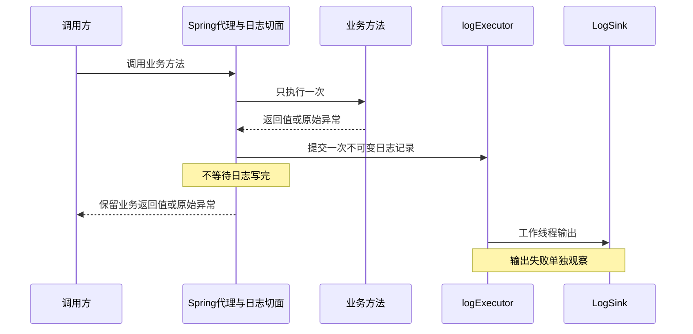
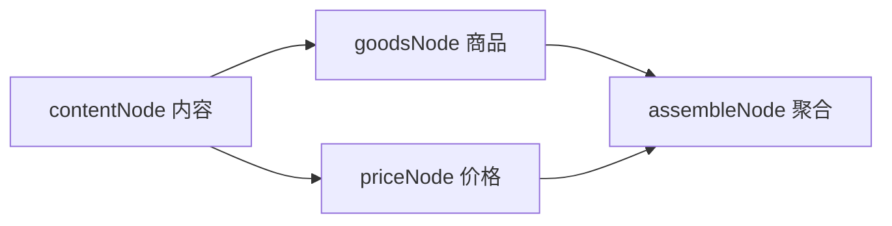
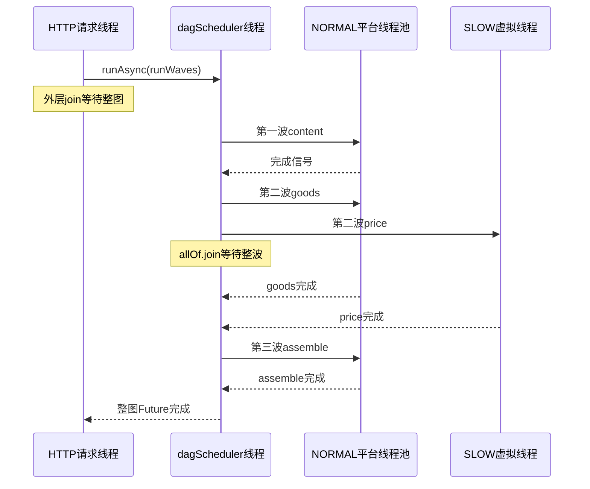

# Java异步课程合并版

本文件方便网页读取，源章节仍独立维护。个人进度由学习者另行提供。


---

来源：[README.md](README.md)

# 线程池与异步编程：扩展机制 × cms-flow 的 8 小时课程

> 公开教材仓库：[网页端GPT阅读入口](GPT_WEB_START.md) · [合并版课程](GPT_COURSE.md) · [源码合并版](GPT_SOURCE.md)
> 本仓库是可复用学习材料。进度与练习记录仅为空白模板；reference为选取的阅读快照。

所有运行命令从仓库根目录执行。Windows可以使用`& '.\实验\run.ps1' -Case all`；macOS/Linux或其他环境可以使用JDK单文件方式`java 实验/AsyncLab.java threads`（需要JDK 21+）。

> 整理日期：2026-09-12 · Java 21 · 学习材料：`.\reference` · 本课程目录：`.`

这份课程围绕一个问题展开：**我提供的接口实现、注解和配置，怎样被框架接入，再把任务交给线程执行？**

现在结合两条业务链学习：`cms-flow` 是真实源码参考；`operation-log-lab` 是工作流提出的后续动手项目。前者让你理解“需要结果的聚合”，后者让你理解“不等待完成的旁路日志”。

材料来源包括原目录的 `MISSION.md`、`NOTES.md`、`lessons/`、当前 Java 源码，以及新提供的 [CODEX_WORKFLOW.md](reference/OPERATION_LOG_WORKFLOW.md)。本页是整合后的课程大纲；本地 [教学与实践工作流](CODEX_WORKFLOW.md) 说明怎样逐轮学习、验收和恢复进度。

## 学完的目标

- 给一段异步代码，标出任务、调用线程、执行线程、执行器、Future、等待点、共享状态、失败传播。
- 解释接口实现、注解、读取注解的处理器与 Spring 装配分别承担什么职责。
- 推演线程池“创建核心线程 → 排队 → 扩容 → 拒绝”的过程。
- 读懂 `runAsync`、`supplyAsync`、`allOf`、`join`，能区分结果转换、依赖串接、独立合并。
- 沿 `GoodsCardDag → TopoScheduler → Executor → 节点结果` 讲清一次请求。
- 解释超时、取消、隔离、虚拟线程及信号量分别解决什么问题。
- 对比“DAG 必须等待所需结果”与“旁路日志提交后不等待写完”，设计成功、拒绝和输出失败的验证方法。

8 小时用于概念主干、现有 Java 实验和扩展机制对照。原工作流 M0—M6 的完整 Spring 项目需要逐阶段实现和测试，工期根据实际进度另计；不把它硬塞成“8小时必然交付”。原小型 DAG 脚手架保留为课后选做，腾出时间学习接口、注解和同步到异步的过程。

## 8 小时大纲

按 **每小时 50 分钟学习 + 10 分钟休息或整理** 安排，总计 480 分钟：400 分钟学习，70 分钟休息，最后 10 分钟整理。可以连续学，也可以分成两天、每天 4 小时。

| 时段 | 整合主题与阅读入口 | 50 分钟内部安排 | 必须留下的产出 |
|---|---|---|---|
| 00:00–01:00 | S1 接口、多态、任务与执行器：[桥接讲义第1部分](%E8%AF%BE%E7%A8%8B/%E6%89%A9%E5%B1%95%E6%9C%BA%E5%88%B6%E4%B8%8E%E5%BC%82%E6%AD%A5%E6%97%A5%E5%BF%97.md)＋[知识章01](%E8%AF%BE%E7%A8%8B/01-%E7%BA%BF%E7%A8%8B%E4%BB%BB%E5%8A%A1%E4%B8%8E%E5%BC%82%E6%AD%A5.md) | 5分基础校准＋10分接口接入＋15分线程模型＋10分threads实验＋10分五问/八问 | 解释“传入实现”与“交给线程执行”的区别 |
| 01:00–02:00 | S2 注解、处理器、代理与同步日志：[桥接讲义第2～3部分](%E8%AF%BE%E7%A8%8B/%E6%89%A9%E5%B1%95%E6%9C%BA%E5%88%B6%E4%B8%8E%E5%BC%82%E6%AD%A5%E6%97%A5%E5%BF%97.md) | 15分注解与读取＋15分代理调用链＋10分cms-flow启动期取证＋10分预测题 | 画出谁读取注解；解释注解不自动产生线程 |
| 02:00–03:00 | S3 原生线程池与回调：[知识章02](%E8%AF%BE%E7%A8%8B/02-%E7%BA%BF%E7%A8%8B%E6%B1%A0%E5%8F%82%E6%95%B0%E4%B8%8E%E6%8B%92%E7%BB%9D.md) | 15分七参数＋10分2/3/2推演＋15分saturation/discard实验＋10分迁移到2/4/3 | 说明ThreadFactory和拒绝处理器由谁、何时调用 |
| 03:00–04:00 | S4 Future与DAG：[知识章03](%E8%AF%BE%E7%A8%8B/03-Future%E4%B8%8E%E7%BB%84%E5%90%88.md)＋[知识章04](%E8%AF%BE%E7%A8%8B/04-DAG%E6%B3%A2%E6%AC%A1%E8%B0%83%E5%BA%A6.md) | 15分runAsync/allOf/join＋15分三波与两等待点＋15分futures/dag实验＋5分复述 | 画三波并指出两个join；thenCompose等细节选读 |
| 04:00–05:00 | S5 专用执行器与异步日志：[桥接讲义第4部分](%E8%AF%BE%E7%A8%8B/%E6%89%A9%E5%B1%95%E6%9C%BA%E5%88%B6%E4%B8%8E%E5%BC%82%E6%AD%A5%E6%97%A5%E5%BF%97.md)＋[知识章05](%E8%AF%BE%E7%A8%8B/05-%E9%9A%94%E7%A6%BB%E5%85%B1%E4%BA%AB%E7%8A%B6%E6%80%81%E4%B8%8E%E4%B8%8A%E4%B8%8B%E6%96%87.md) | 15分同步改异步设计＋15分SideEffectRunner对照＋10分隔离/上下文＋10分starvation实验 | 画一次提交的日志链；说明哪里不该join |
| 05:00–06:00 | S6 异常、拒绝、超时与取消：[知识章06](%E8%AF%BE%E7%A8%8B/06-%E5%BC%82%E5%B8%B8%E8%B6%85%E6%97%B6%E4%B8%8E%E5%8F%96%E6%B6%88.md) | 15分失败分类＋15分failure/timeout/cancel实验＋10分日志故障对照＋10分口述 | 区分业务失败、提交拒绝和输出失败 |
| 06:00–07:00 | S7 虚拟线程、信号量和背压：[知识章07](%E8%AF%BE%E7%A8%8B/07-%E8%99%9A%E6%8B%9F%E7%BA%BF%E7%A8%8B%E4%B8%8E%E4%BF%A1%E5%8F%B7%E9%87%8F.md) | 15分资源维度＋15分virtual实验＋10分三条释放路径＋10分装配核对 | 说明VT不增加下游容量；识别存在但未装配的实现 |
| 07:00–08:00 | S8 配置、关闭与迁移验收：[桥接讲义第5～6部分](%E8%AF%BE%E7%A8%8B/%E6%89%A9%E5%B1%95%E6%9C%BA%E5%88%B6%E4%B8%8E%E5%BC%82%E6%AD%A5%E6%97%A5%E5%BF%97.md)＋[验收自测](%E9%AA%8C%E6%94%B6%E8%87%AA%E6%B5%8B.md) | 10分配置与关闭＋15分迁移表＋15分8道核心题＋10分三项测试设计；最后10分记录 | 一张扩展点迁移表、一个当前卡点、明确下一里程碑 |

S1—S8 是小时安排，M0—M6 是后续工程里程碑，两者不一一等同。原文件01—08现在作为知识章节使用，文件中的完整阅读用时不重复叠加；本轮只读表中选定部分。

每节遵循：**需求 → 扩展点 → 我提供什么/谁使用/何时使用/怎样接入/失败怎么办 → 代码预测 → 实验或源码取证 → 复述**。涉及多线程再填原有八问卡。S2与S8包含设计和源码取证，不宣称它们已经跑过Spring测试。

## 内容优先级

| 层次 | 本次内容 |
|---|---|
| 必会 | 接口与调用者；注解与处理器；线程/任务/Executor/Future；七参数；拒绝；runAsync/allOf/join；三波DAG；关键结果与旁路任务的等待差异 |
| 重点理解 | 代理调用边界；同步到异步只提交一次；异常和超时；共享状态；VT与Semaphore；配置与关闭的证据 |
| 选读 | thenApply/thenCompose/thenCombine深入；MDC细节；CPU/I/O参数估算；Java21 pinning；完整小型DAG练习 |
| 后续工程实践 | operation-log-lab M0—M6：真实Spring代理、ThreadPoolTaskExecutor、@Async独立对照、配置和回归测试 |
| 后续独立专题 | AQS/JMM深入、通用事件驱动DAG、结构化并发、JFR/压测、MQ可靠性、生产deadline改造 |

这里的“异步”以 **JVM内的任务执行和结果组合** 为主。操作日志组件沿用原任务书的“尽力记录”定位，拒绝和输出失败可观察，但不承诺进程崩溃后的可靠投递。

## 第一步

先读 [桥接讲义第1部分](%E8%AF%BE%E7%A8%8B/%E6%89%A9%E5%B1%95%E6%9C%BA%E5%88%B6%E4%B8%8E%E5%BC%82%E6%AD%A5%E6%97%A5%E5%BF%97.md) 的LogSink例子，再做 [知识章01](%E8%AF%BE%E7%A8%8B/01-%E7%BA%BF%E7%A8%8B%E4%BB%BB%E5%8A%A1%E4%B8%8E%E5%BC%82%E6%AD%A5.md) 开头的线程预测。首次学习从S1开始；已有进度的读者可从自己的检查点继续。

运行实验需要JDK 21或更高版本。实验只使用 JDK，不需要 Maven、Spring、Redis、Docker 或启动参考项目。命令、情景索引见 [实验说明](%E5%AE%9E%E9%AA%8C/README.md)。

所有实验中的毫秒数都是**人为设置的教学等待时间**，不是 cms-flow 的真实压测数据。并发日志允许交错，判断依赖顺序与状态，不用一字不差比对日志。

## 学习时使用的文件

- [源码地图与资料勘误](%E6%BA%90%E7%A0%81%E5%9C%B0%E5%9B%BE%E4%B8%8E%E8%B5%84%E6%96%99%E5%8B%98%E8%AF%AF.md)：定位到原文件和方法，旧笔记与当前实现的差异。
- [桥接讲义](%E8%AF%BE%E7%A8%8B/%E6%89%A9%E5%B1%95%E6%9C%BA%E5%88%B6%E4%B8%8E%E5%BC%82%E6%AD%A5%E6%97%A5%E5%BF%97.md)：接口、注解、AOP、异步日志与cms-flow对照。
- [整合工作流](CODEX_WORKFLOW.md)、[阶段计划](docs/PLAN.md)、[恢复进度](docs/PROGRESS.md)：课程学习与项目实施分开记录。
- [学习记录与八问卡](%E5%AD%A6%E4%B9%A0%E8%AE%B0%E5%BD%95.md)：每课填写预测、观察、解释，初始均为待验证。
- [实验源码 AsyncLab.java](%E5%AE%9E%E9%AA%8C/AsyncLab.java)：可运行的概念演示，一次只读对应方法。
- [综合练习 PracticeDag.java](%E5%AE%9E%E9%AA%8C/PracticeDag.java)：保留六个TODO，整合路线中改为课后选做。
- [验收自测](%E9%AA%8C%E6%94%B6%E8%87%AA%E6%B5%8B.md)：先答题，再展开答案。
- [材料验证记录](%E6%9D%90%E6%96%99%E9%AA%8C%E8%AF%81%E8%AE%B0%E5%BD%95.md)：区分材料是否可运行和你是否已掌握。

如果基础语法卡住，先把该小时实验改成逐行解释；Future部分先掌握`supplyAsync + allOf + join`。S2只要求区分注解和处理器、画出代理调用链；AOP实现细节留到M3。8小时结束时记录实际完成位置，不用赶进度替代理解。

继续学习可直接发：

> 读取 `.\CODEX_WORKFLOW.md` 和 `docs\PROGRESS.md`，按整合大纲带我学S1。一次只问一个问题，先让我预测；我明确说不理解时直接解释卡点。使用现有材料，本轮不启动M0工程搭建，按真实回答记录学习状态。


---

来源：[课程/扩展机制与异步日志.md](%E8%AF%BE%E7%A8%8B/%E6%89%A9%E5%B1%95%E6%9C%BA%E5%88%B6%E4%B8%8E%E5%BC%82%E6%AD%A5%E6%97%A5%E5%BF%97.md)

# 桥接讲义：接口、注解、框架调用与线程池

> 对应整合大纲S1、S2、S5、S8。按指定部分阅读，不在8小时之外额外安排整章。`operation-log-lab`的类名来自原任务书设计，尚不是当前目录已经实现的类；cms-flow链接指向已存在的源码。

## 1. 接口：我把哪一种能力交给谁（S1）

先预测：调用者接收一个`LogSink`，换一个实现后，是换了调用者，还是换了具体输出行为？

```java
// 设计片段：只说明对象关系，不是本轮已运行的项目代码。
interface LogSink {
    void write(OperationLogRecord record);
}

class OperationLogService {
    private final LogSink sink;
    OperationLogService(LogSink sink) { this.sink = sink; }
    void record(OperationLogRecord record) { sink.write(record); }
}
```

`LogSink`规定能力，具体实现决定把记录写到控制台还是测试内存。`OperationLogService`只持有接口引用并调用它。纯Java可以手动`new`实现并传入构造器；Spring场景由容器创建、选择并注入注册的Bean。写了接口，不意味着容器自动找到所有实现，也不意味着调用变成异步。

对照cms-flow：看[NodeRequestParser接口](reference/cms-flow/cms-flow-core/src/main/java/com/cms/flow/spi/NodeRequestParser.java)，再看[HttpNodeExecutor.invokeHttp](reference/cms-flow/cms-flow-core/src/main/java/com/cms/flow/nodetype/HttpNodeExecutor.java#L108)。节点配置提供解析器类型；执行器向ApplicationContext取对应Bean，再调用其`build`。接口描述怎样组装请求，框架决定在哪个调用点使用实现。

本节只填五问：我提供了什么实现？谁调用？什么时候？怎样选到并注入？实现返回null或失败时怎么办？然后进入知识章01，区分“对象被调用”和“任务被哪个线程执行”。

## 2. 注解：声明信息与处理信息分开（S2前半段）

原任务书里的`@OpLog("修改资料")`声明操作名称。必须有代码读取它、构造记录并调用LogSink，日志才会产生。运行时保留只说明运行时能读到，不代表自动执行处理逻辑。

这里最容易与Spring的扫描能力混淆。cms-flow的[FlowDag](reference/cms-flow/cms-flow-core/src/main/java/com/cms/flow/dag/FlowDag.java)同时声明TYPE、RUNTIME，并带`@Component`；这使它可以参与Spring组件扫描。真正收集、读取和注册图的代码在[FlowDagDefinitionCollector](reference/cms-flow/cms-flow-core/src/main/java/com/cms/flow/dag/FlowDagDefinitionCollector.java#L26)。

只看它的启动回调，沿这条链找证据：

```text
Spring完成单例初始化后调用afterSingletonsInstantiated
  → getBeansWithAnnotation(FlowDag.class)
  → 检查Bean实现FlowDagDefinition
  → 读取FlowDag元数据
  → 调用definition.configure(builder)
  → 校验并注册DagDefinition
```

这是启动期装配。请求到来后才由运行时调度器执行图；不是每次请求都重新读取注解并构建整个拓扑。`@FlowDag`也不是AOP切面的别名。

动手取证：自己在Collector里找出“读取信息”“调用用户实现”“注册结果”三处。原任务书M2的反射实验会在后续工程实践中单独实现，本节不把源码阅读算成该测试通过。

## 3. AOP：处理器怎样进入业务调用（S2后半段）

同步操作日志的设计链路是：

```text
外部Bean → Spring代理 → OperationLogAspect
                         → 业务方法（只执行一次）
                         → 构造OperationLogRecord
                         → OperationLogService → LogSink
```

在同步阶段，切面、业务和Sink仍在当前调用线程上执行。环绕通知通过一次`proceed`调用业务，再测量耗时并记录成功或异常；日志的普通输出故障需要独立处理，不能替换原业务返回值或原始异常。严重Error不作为普通输出失败吞掉。这些是拟建项目的行为要求，验收在M3。

默认代理模式需要调用经过代理。目标对象在自身方法里直接调用另一个方法，可能绕过代理增强；`@Async`也有相似的代理边界，但它触发的是异步提交能力。**AOP不是线程池，注解也不是工作线程。**

这里只支持原任务书约定的“实现类公开方法直接标注OpLog且从外部经过Spring代理”场景；不在第一轮展开继承、桥接方法等兼容规则。Spring相关语义可对照[官方任务执行文档](https://docs.spring.io/spring-framework/reference/integration/scheduling.html)，本课没有新建或运行代理测试。

预测题：只加`@OpLog`、不注册任何读取它的处理器，会出现记录吗？同步切面里调用Sink，会自动换线程吗？先回答，再沿设计调用链检查。

## 4. 从同步日志到一次异步提交（S5）

设计中的M5链路：



工作线程可能在调用方返回之前或之后开始运行，图不保证固定时间顺序；关键要求是业务返回不依赖Sink完成。用不可变记录传递必要字段，不把整个可变请求对象、业务参数或敏感内容带到异步线程。

主链路显式提交给命名的`ThreadPoolTaskExecutor logExecutor`。`@Async("logExecutor")`保留为独立对照Bean，通过外部Bean调用并观察Future异常，不能再处理主链路同一条日志。否则可能出现重复日志或不必要的双重异步。

### 与cms-flow并排看

| 场景 | 结果是否决定当前响应 | 等待点 | 失败边界 |
|---|---|---|---|
| DAG节点执行 | 当前响应依赖所需节点结果 | TopoScheduler的两层join | 调度异常或节点失败结果进入相应处理 |
| cms-flow缓存旁路任务 | 通常不等待缓存写完成 | SideEffectRunner不join | 当前池可丢弃并计数，部分执行失败记录warn |
| 拟建操作日志 | 本课程定义为尽力记录，业务响应不依赖Sink完成 | 请求链不get/join | 提交拒绝和已接收任务输出失败分别可观察，普通日志故障不覆盖业务结果 |

只精读[SideEffectRunner.execute](reference/cms-flow/cms-flow-core/src/main/java/com/cms/flow/executor/SideEffectRunner.java#L31)和[Registry的sideEffect构造](reference/cms-flow/cms-flow-core/src/main/java/com/cms/flow/executor/FlowExecutorRegistry.java#L75)。它们提供“旁路执行”的真实对照，但拒绝策略和异常处理不应原样照搬：现有SideEffectRunner捕获Throwable；操作日志任务书则要求普通失败不覆盖业务结果且不吞严重Error。

当前sideEffect池的自定义拒绝处理器会丢弃并计数；拟建logExecutor要明确抛出拒绝，在提交边界计数、处理。这不是两个项目必须使用同一策略。

### 三个不同的量

- 业务调用成功：业务返回了正常结果。
- 日志任务被接受：执行器接受了此次提交，不代表已输出。
- 日志输出成功：工作线程实际完成Sink调用。

另外记录“提交拒绝次数”和“输出失败次数”。不要只用一个总失败数混在一起，也不要把Future无人读取时的异常当成已观察。

## 5. 线程池、配置与关闭怎样迁移（S3、S8）

原有演示使用core=2/max=3/queue=2：任务持续阻塞时接纳5个、第6个拒绝。任务书M4使用2/4/3：在工作线程创建成功、池未关闭、任务都未结束的同样条件下接纳7个、第8个拒绝。

这是参数迁移，不是数学结论矛盾。当前saturation演示实际验证的是2/3/2；2/4/3、关闭后拒绝和submit异常读取的完整检查仍列入M4，不能写成已经运行过。

`ThreadFactory`由线程池需要创建线程时调用；`RejectedExecutionHandler`由线程池接不住新提交时调用。你提供实现，执行器在特定时机回调，这和“我提供LogSink，由日志服务调用”是同一种接口接入关系。

配置也要追消费链：[CmsFlowExecutorProperties](reference/cms-flow/cms-flow-core/src/main/java/com/cms/flow/autoconfigure/CmsFlowExecutorProperties.java) → [AutoConfiguration工厂方法](reference/cms-flow/cms-flow-core/src/main/java/com/cms/flow/autoconfigure/CmsFlowAutoConfiguration.java#L78) → Registry构建实际池。拟建日志项目的M6要单独验证非法配置初始化失败、禁用时不提交和有界关闭，不把“配了字段”当行为生效。

现有演示用同步器确定观察点，部分使用sleep模拟耗时，**不靠sleep推断任务已经完成**。它们有门闩超时和关闭所有者，但目前`ExecutorService.close()`本身没有独立终止时间上限；因此不能把既有演示写成已经满足原任务书“所有测试均有界关闭”的工程验收。后续M4—M6需按任务书验证释放阻塞任务、shutdown、awaitTermination及必要的shutdownNow，并检查任务响应中断。

## 6. 五问迁移表与S8练习

先自己填写至少三行，不要求现在编写新Spring工程：

| 组件 | 我提供什么 | 谁使用 | 何时使用 | 怎样接入 | 失败怎么办 |
|---|---|---|---|---|---|
| LogSink | 接口实现 | 日志服务/异步任务 | 一次记录输出时 | 构造器注入选定Bean | 普通输出失败独立计数，不覆盖业务结果 |
| OpLog | 方法上的操作名称 | 拟建日志切面 | 经代理调用时 | 注解和切面均接入Spring | 未配置处理器时不会自动产生日志 |
| ThreadFactory | 待填写 | | | | |
| RejectedExecutionHandler | 待填写 | | | | |
| FlowDagDefinition | 待填写 | | | | |
| NodeRequestParser | 待填写 | | | | |
| logExecutor配置 | 待填写 | | | | |

S8的三个测试设计题：

1. 怎样用门闩阻塞Sink，并证明业务返回不依赖它？写出启动信号、返回信号、最长等待和finally释放位置。
2. 怎样人为制造队列满，证明只增加拒绝计数且业务原返回值/异常保持不变？
3. 怎样让已接收任务的Sink抛普通异常，证明输出失败可见且没有生成第二条日志？

这些题目前只要求设计并解释；工程实现和测试运行证据分别记录在M5/M6。完成之后再选课后DAG TODO或M0项目实践，不同时展开两个实现任务。


---

来源：[课程/01-线程任务与异步.md](%E8%AF%BE%E7%A8%8B/01-%E7%BA%BF%E7%A8%8B%E4%BB%BB%E5%8A%A1%E4%B8%8E%E5%BC%82%E6%AD%A5.md)

# 第 01 课：任务交给谁，谁在等待

> 前置：能识别变量、方法调用和 `new`。目标：分清 Task / Thread / Executor / Future。用时：50 分钟。

## 先预测（5 分钟）

```java
Runnable task = () -> System.out.println(Thread.currentThread().getName());
task.run();
pool.execute(task);
```

这里写了几个任务对象？调用了几次任务？两次输出一定来自同一线程吗？暂时不要背“异步”定义，写下你的解释。

如果 `() -> ...` 看不懂：它表示“先把这段无参数、无返回值的动作保存起来”。赋值只创建动作；`run()` 才执行动作；`execute(task)` 把动作交给执行器处理。

## 这几个名字是什么（15 分钟）

| 名字 | 具体含义 | 本项目中的例子 |
|---|---|---|
| 进程 | 正在运行的 JVM，持有内存等资源 | cms-flow-biz 服务 |
| 线程 Thread | 执行代码的一条路径 | HTTP 请求线程、节点池工作线程 |
| 任务 Task | 需要执行的一段代码 | `() -> runNode(dag, ctx, nodeId)` |
| Executor | 接受任务，决定如何执行的接口 | dagScheduler、nodeInvoke |
| Future | 记录任务是否完成、结果或失败的句柄 | `CompletableFuture<Void>` |

同一个任务对象可以被执行多次，任务本身不是线程。`Runnable.run()` 是普通方法调用；`new Thread(task).start()` 才请求启动一个新线程来执行任务。

“同步/异步”讨论调用后何时得到完成结果；“阻塞/非阻塞”讨论等待期间线程是否被占住；“并发/并行”讨论多个任务的推进关系。它们不是同一组反义词。

例如 `runAsync(task, pool)` 安排任务后返回 Future，随后调用 `join()` 的线程又会等待。**任务执行可以异步，调用者仍可以在后面阻塞。**

Executor 接口并不保证换线程。下面的执行器就直接在调用线程上执行：

```java
Executor direct = Runnable::run;
direct.execute(task);
```

这也是项目 `TopoSchedulerTest` 使用的办法：它能检查拓扑结果，但该测试本身不证明任务在真实线程上并行。接口允许不同执行策略，见 [Java 21 Executor](https://docs.oracle.com/en/java/javase/21/docs/api/java.base/java/util/concurrent/Executor.html)。

## 实验（15 分钟）

```powershell
& '.\实验\run.ps1' -Case threads
```

先说运行目的：观察同一个 Runnable 在直接调用和线程池执行下的线程身份。再找输出里的 `main` 与 `worker-*`。演示还用门闩让工作线程等待，因此可以检查 Future 在放行前是否完成。

改动实验只发生在本课程的 `AsyncLab.java`：找到 `threads()` 中的 `pool.execute(task)`，临时改成 `task.run()`，预测线程名后重跑，最后还原。这是本课的破坏性实验。

<details><summary>预测后再展开核对</summary>

一个 Runnable 对象，调用两次。直接 `run()` 在当前调用线程；这里创建的平台线程池把第二次执行交给工作线程。主线程在 Future 的等待点停止继续执行，但工作线程可以继续推进。不能仅凭出现 `Executor` 或 `Future` 就断言已经新建线程。

</details>

## 回到源码与验收（15 分钟）

打开 [TopoScheduler.java 第 50 行](reference/cms-flow/cms-flow-core/src/main/java/com/cms/flow/engine/TopoScheduler.java#L50)，只读 `execute()`。

把这一行拆成三步：

```java
CompletableFuture.runAsync(() -> runWaves(dag, ctx), dagScheduler).join();
```

1. 创建“执行 runWaves”的任务。
2. 交给 dagScheduler，得到 Future。
3. 当前 HTTP 请求线程调用 join，等待整图调度完成。

`runWaves` 转移到了别的线程，不表示 HTTP 请求线程已经释放。把这段代码填入 [八问卡](%E5%AD%A6%E4%B9%A0%E8%AE%B0%E5%BD%95.md)；还未学到的共享状态与失败传播允许写“待第 05/06 课核对”。

30 秒复述：**任务是什么、谁提交、谁执行、谁等待？** 能指到代码中的四处才算本课通过。


---

来源：[课程/02-线程池参数与拒绝.md](%E8%AF%BE%E7%A8%8B/02-%E7%BA%BF%E7%A8%8B%E6%B1%A0%E5%8F%82%E6%95%B0%E4%B8%8E%E6%8B%92%E7%BB%9D.md)

# 第 02 课：线程池如何接住任务，何时拒绝

> 前置：第 01 课。目标：推演任务去向，解释有界资源与拒绝。用时：50 分钟。

## 先预测

一个新建、未关闭的线程池，核心线程数 2，最大线程数 3，队列容量 2。所有任务开始后都被门闩卡住，不会提前结束。连续提交 6 个任务，各去哪儿？

## 七个参数（15 分钟）

项目在 [FlowExecutorRegistry.newPlatformPool](reference/cms-flow/cms-flow-core/src/main/java/com/cms/flow/executor/FlowExecutorRegistry.java#L200) 创建线程池：

```java
new ThreadPoolExecutor(
    core, max, 60L, TimeUnit.SECONDS,
    new ArrayBlockingQueue<>(queue),
    namedFactory(prefix), handler
);
```

| 参数 | 该回答的问题 |
|---|---|
| corePoolSize | 优先创建到多少个工作线程？默认并非启动时全部创建 |
| maximumPoolSize | 队列放不下后，工作线程最多扩到多少个？ |
| keepAliveTime | 超过核心数量的空闲线程保留多久？ |
| unit | 上述时间用什么单位？ |
| workQueue | 等待任务放哪里，最多放多少个？ |
| threadFactory | 如何创建和命名线程？ |
| handler | 资源满了或池关闭后如何拒绝新任务？ |

正常运行、线程工厂能创建线程时，先看线程数是否小于 core；达到 core 后优先入队；队列满了才尝试扩到 max；仍接不住就拒绝。最大线程数不是“任务一多立即开满”的目标。[JDK 21 线程池规则](https://docs.oracle.com/en/java/javase/21/docs/api/java.base/java/util/concurrent/ThreadPoolExecutor.html)

无界队列会让正常提交持续排队，使 max 通常失去扩容作用；队列增长还会延长等待。`newFixedThreadPool` 的便利构造隐藏了无界队列，理解成本后再选。`newCachedThreadPool` 则需要注意可能持续增加线程。

<details><summary>六个任务的去向</summary>

1、2 创建两个核心工作线程；3、4 排队；5 因队列满而创建第 3 个工作线程；6 拒绝。此时 3 个任务运行、2 个排队，总共接纳 5 个。这不是永恒容量公式，只对应本题“任务都不结束”的稳定条件。

</details>

## 四类拒绝方式（10 分钟）

| 策略 | 饱和时发生什么 | 代价 |
|---|---|---|
| AbortPolicy | 向提交方抛 `RejectedExecutionException` | 调用方需要处理失败 |
| CallerRunsPolicy | 池仍运行时，由提交线程执行任务 | 提交可能很慢；可能占住 HTTP/调度线程；关闭后会丢弃 |
| DiscardPolicy | 直接丢任务 | 等待该任务结果的人可能永远等不到 |
| DiscardOldestPolicy | 池仍运行时丢队头任务，再尝试提交当前任务 | 被丢旧任务的结果可能悬空 |

项目当前 NORMAL、FAST、dagScheduler 使用“计数后抛异常”的自定义 Abort 行为；sideEffect 才允许丢弃并计数。旧笔记的 NORMAL/FAST Discard 表格已过时，证据见 [资料勘误](%E6%BA%90%E7%A0%81%E5%9C%B0%E5%9B%BE%E4%B8%8E%E8%B5%84%E6%96%99%E5%8B%98%E8%AF%AF.md)。

## 实验（15 分钟）

```powershell
& '.\实验\run.ps1' -Case saturation
& '.\实验\run.ps1' -Case discard
```

第一项用门闩固定任务不结束，验证 2/3/2 的分配。第二项把线程和队列都占满，再通过 `CompletableFuture.runAsync` 提交一个被静默丢弃的任务；演示使用带时限等待，避免终端永久挂住。

预测：没有抛拒绝异常就代表提交成功了吗？观察 `Future未完成=true`。Future 已创建，但包装任务没有执行，就没人把它完成。

## 回源码、参数与关闭（10 分钟）

读 `newPlatformPool`、`countingAbort` 和 `shutdownPlatform`，只解释这三个方法。项目使用有界 `ArrayBlockingQueue`；参数还经过最小值处理，不能只根据 YAML 任意负数预测运行行为。

线程数应结合任务耗时、CPU 工作量、下游连接/并发容量和测量来定。用作初始估算时，平均在途量约等于“每秒进入的任务数 × 平均停留秒数”，必须说明统计的是节点还是整图请求；它不是线程数的万能公式。大队列能够延后拒绝，也可能让请求排到过期。

`shutdown()` 停止接收新任务，已接受任务继续处理；`awaitTermination` 等待结束；`shutdownNow()` 尝试中断并取出未启动任务，不能保证强制杀死正在运行的业务。项目守护线程也不代表写缓存一定完成。

30 秒复述：给我 core/max/queue，你怎样判断下一个任务去哪儿？如果任务被丢弃，谁还在等它？


---

来源：[课程/03-Future与组合.md](%E8%AF%BE%E7%A8%8B/03-Future%E4%B8%8E%E7%BB%84%E5%90%88.md)

# 第 03 课：结果何时回来，多个结果如何组合

> 前置：第 01、02 课。目标：区分提交、等待和结果组合。用时：50 分钟。

## 先预测

```java
var a = CompletableFuture.supplyAsync(() -> queryGoods(), pool);
var b = CompletableFuture.supplyAsync(() -> queryPrice(), pool);
CompletableFuture.allOf(a, b).join();
```

如果两个任务分别模拟耗时 200 ms 和 350 ms，线程充足且无其他竞争，接近 350 ms 还是 550 ms？把第一行改为 `supplyAsync(...).join()` 后才提交 b，会发生什么？

## 从 Future 开始（15 分钟）

`Runnable` 描述无返回值任务；`Callable<T>` 描述有返回值、可抛受检异常的任务。`Executor.execute` 返回 void；`ExecutorService.submit` 可以返回 Future。`submit` 中的任务异常通常保存在 Future 中，需要取结果或显式检查，不能以“日志没报错”当成功。

普通 Future 适合“拿到句柄，再等待或检查”；CompletableFuture 还可以声明“完成后做什么”。泛型 `CompletableFuture<String>` 表示最终成功结果类型是 String；`CompletableFuture<Void>` 表示只关心完成，不携带业务结果。[Java 21 Future](https://docs.oracle.com/en/java/javase/21/docs/api/java.base/java/util/concurrent/Future.html)

| 操作 | 本课用法 |
|---|---|
| `runAsync(task, executor)` | 提交无返回值的 Runnable |
| `supplyAsync(supplier, executor)` | 提交产生结果的 Supplier |
| `get()` / `get(timeout, unit)` | 等结果；后者限制这次等待时长；异常需要显式处理 |
| `join()` | 等结果，异常完成通常以 CompletionException 抛出；取消还可能直接抛 CancellationException |
| `allOf(a,b)` | 产生一个等所有输入完成的 Future，结果类型 Void，不自动收集 a/b 的值 |

`join` 不是“开始执行”的开关，任务在提交后就有机会执行。正常情况下显式 executor 决定异步任务去哪里；省略时 CompletableFuture 通常使用公共 ForkJoinPool，不应默认等同于项目业务池。

## 三种组合（10 分钟）

下面是教学示例，项目当前 TopoScheduler 主线使用 `runAsync + allOf + join`，不是已经用全了这些 API。

```java
// 原结果 -> 新值，适合短转换
var name = goods.thenApply(g -> g.name());

// 原结果 -> 下一项异步任务，把嵌套 Future 拉平
var detail = id.thenCompose(i -> queryDetailAsync(i));

// 两项独立任务都成功后合并结果
var card = goods.thenCombine(price, (g, p) -> new Card(g, p));
```

`thenApply` 的函数返回普通值；`thenCompose` 的函数返回下一阶段 Future；`thenCombine` 需要两个结果。非 Async 回调不保证切线程，可能在完成前序任务的线程或注册回调的调用线程执行；耗时工作需要认真选择执行器。[CompletableFuture 语义](https://docs.oracle.com/en/java/javase/21/docs/api/java.base/java/util/concurrent/CompletableFuture.html)

## 实验（15 分钟）

```powershell
& '.\实验\run.ps1' -Case futures
```

在 `AsyncLab.futures()` 找到两次 `supplyAsync`、`thenCombine` 和最后一次 `join`。记录线程名、合并结果，以及分别提前等待造成的顺序变化。

手写 3 行：提交 goods；提交 price；等待两项完成。不要求你从头写 main。再补一行通过 `a.join()` 和 `b.join()` 取值——此时二者已完成，不会重新执行查询。

<details><summary>核对提示</summary>

充分并行时接近较慢任务的 350 ms，加调度开销。先提交 a 立即 join，然后才提交 b，就把两个查询串行化，接近 550 ms。若线程池只有一个工作线程，即使先提交两个也未必并行。

</details>

## 回源码与复述（10 分钟）

找到 [TopoScheduler 第 86 行附近](reference/cms-flow/cms-flow-core/src/main/java/com/cms/flow/engine/TopoScheduler.java#L86)，解释 `List<CompletableFuture<Void>> wave` 保存的是什么。节点业务结果另存在 ExecutionContext，Future 在这里主要充当完成信号。

30 秒复述：**Executor 负责执行，Future 记录完成，allOf 组合完成条件，join 让当前线程等待。** 再自己举一个 thenCompose 与 thenCombine 的区别例子。


---

来源：[课程/04-DAG波次调度.md](%E8%AF%BE%E7%A8%8B/04-DAG%E6%B3%A2%E6%AC%A1%E8%B0%83%E5%BA%A6.md)

# 第 04 课：从依赖图推演到线程上的执行过程

> 前置：第 03 课。目标：画出三波与两层等待。用时：50 分钟。

## 先画图、预测（10 分钟）

先读 [GoodsCardDag.configure](reference/cms-flow/cms-flow-biz/src/main/java/com/cms/flow/definition/GoodsCardDag.java#L30) 的四条 `EdgeSpec.link`。箭头表示前者完成后，后者才满足这条依赖。



先写出每个节点入度、第一波能执行的节点，以及为什么不能一开始执行 assemble。第二波哪个先打印开始或结束不确定，不应把列表遍历顺序当完成顺序。

## Kahn 波次的五步（15 分钟）

读 [TopoScheduler.runWaves](reference/cms-flow/cms-flow-core/src/main/java/com/cms/flow/engine/TopoScheduler.java#L63)：

1. 用 `indegree` 记录每个节点尚有多少前置依赖，用 `successors` 记录它完成后会影响谁。
2. 所有入度为 0 的节点成为 `current`。
3. 把 current 中的每个节点交给其执行器，收集一波 Future。
4. `allOf(...).join()` 等当前整波完成，再对它们的后继减入度。
5. 新入度为 0 的节点组成下一波；若最后完成数不等于总节点数，报告可能存在环。

本图三波是 `{content}`、`{goods, price}`、`{assemble}`。入度初始为 0、1、1、2。`finished` 统计已经走完的节点，不等同于“业务成功个数”。

### 两层线程转移



当前 PriceNodeSpec 标记 SLOW；聚合节点由 NodeInvokeExecutorResolver 强制走 NORMAL。这里体现的是读取到的当前默认配置，不是说所有 DAG 都必须这么划分。

## 最小实验（15 分钟）

```powershell
& '.\实验\run.ps1' -Case dag
```

本演示采用固定三波，不实现通用图算法，便于先观察线程名。content=100 ms、goods=200 ms、price=350 ms、assemble=50 ms 都是教学值。忽略竞争与开销，串行约 700 ms，按图并行约 `100 + max(200,350) + 50 = 500 ms`。

观察每个节点的开始/结束事件。成功证据：content 结束后 goods/price 才开始；assemble 开始前两者都已结束。不要要求实测恰好 500 ms。

## 波次屏障的限制与复述（10 分钟）

当前实现等“整波”，并非每个节点一完成就立即释放它的后继。反例：A、B 同波；C 只依赖 A；A=100 ms、B=1000 ms。即使 A 100 ms 就结束，C 仍要等 B 所在整波结束。这个简单模型便于理解，也可能引入额外等待。

课后扩展才考虑事件驱动调度，当前无需改参考源码。

<details><summary>本课自查</summary>

- 外层 join 占住 HTTP 请求线程；内层 join 占住 dagScheduler 工作线程。
- 节点工作在线程池或虚拟线程执行器上推进。
- 同波可能并行，但资源不足时也会排队；依赖不能靠“多开线程”绕过。
- HTTP 节点业务失败是否使 Future 异常，要继续看第 06 课的 catch 与结果存储。

</details>

30 秒复述：从 `edges` 开始，逐项指认第一波、第二波、两个 join 和结果存放位置。


---

来源：[课程/05-隔离共享状态与上下文.md](%E8%AF%BE%E7%A8%8B/05-%E9%9A%94%E7%A6%BB%E5%85%B1%E4%BA%AB%E7%8A%B6%E6%80%81%E4%B8%8E%E4%B8%8A%E4%B8%8B%E6%96%87.md)

# 第 05 课：为什么拆池，结果和日志如何跨线程

> 前置：第 04 课。目标：识别线程饥饿、共享状态与上下文边界。用时：50 分钟。

## 先预测

只有 1 个工作线程。父任务占着它，向同一个池提交子任务，然后 `child.get()`。子任务在哪里等待？父任务又在等谁？

## 本项目的五类执行器（15 分钟）

从 [FlowExecutorRegistry](reference/cms-flow/cms-flow-core/src/main/java/com/cms/flow/executor/FlowExecutorRegistry.java#L50) 和 [application.yml](reference/cms-flow/cms-flow-biz/src/main/resources/application.yml#L33) 取证。

| 角色 | 当前默认实现与 core/max/queue | 饱和策略 | 它承担的工作 |
|---|---|---|---|
| dagScheduler | 平台池 8/32/512 | 计数并抛异常 | 每个请求的波次循环，也会等待整波 |
| NORMAL | 平台池 16/32/256；可切 VT | 平台模式计数并抛异常 | 普通节点，含 assemble |
| FAST | 平台池 8/32/128，首次使用时创建 | 计数并抛异常 | 配置为 FAST 的 HTTP 节点 |
| SLOW | 每任务一个虚拟线程，首次使用时创建 | 无应用层并发上限 | 当前 priceNode |
| sideEffect | 平台池 2/4/128 | 丢弃并计数 | 缓存写等允许丢失的旁路任务 |

当前 goodsCard 没有把 HTTP 节点指定为 FAST，因此端点可能还没有 FAST 项。五类是能力划分，不表示启动时五类都已创建。

拆开调度与执行池能避免某类“父任务把子任务执行资源占满”的线程饥饿；快慢隔离还能减少共享工作线程造成的干扰。但它不保证整图不受慢节点影响：assemble 依赖 price，price 慢仍影响最终响应。共享 CPU、网络和下游连接也仍可能竞争。

## 饥饿实验（10 分钟）

```powershell
& '.\实验\run.ps1' -Case starvation
```

演示让单线程池里的父任务等待同池子任务，并用 200 ms 等待上限退出。观察父任务等待超时之后，排队的子任务才获得执行机会。这里的超时是教学装置，不是生产修复方案；思考拆池、先完成父工作再组合结果等结构变化。

## 共享状态（10 分钟）

[ExecutionContext](reference/cms-flow/cms-flow-core/src/main/java/com/cms/flow/engine/ExecutionContext.java#L21) 为每次请求保存一份 `nodeResults`，底层是 ConcurrentHashMap。goods 与 price 可并发写各自的键，assemble 在后续波读取结果。

线程安全 Map 保护的是 Map 的并发操作，不会自动把值里面的 ArrayList 或业务对象变成线程安全。`get → 计算 → put` 的多个调用也不会自动组成原子操作；计数类需求考虑 `merge/compute` 或 AtomicInteger 等合适原语。

`runWaves` 内部的普通 HashMap 入度表只由那个请求的调度线程读写，所以不需要因为“项目有多线程”就全部替换为 ConcurrentHashMap。**判断依据是哪些线程实际访问这个对象。**

## MDC 与 ThreadLocal（5 分钟）

MDC 保存日志上下文，例如 traceId。它不能自动代表“整个请求跨线程共享”的上下文。读 [MdcPropagatingExecutor.execute](reference/cms-flow/cms-flow-core/src/main/java/com/cms/flow/executor/MdcPropagatingExecutor.java#L21)：提交时复制调用方 MDC；工作线程开始时装入副本；finally 恢复工作线程原来的 MDC，必要时清空。

漏掉 finally 可能把上个任务的标识残留给下一个任务。这个包装只传播 MDC，不表示同时传播了所有 ThreadLocal、安全上下文或数据库事务。

## 指标与复述（10 分钟）

读 [CmsFlowExecutorEndpoint](reference/cms-flow/cms-flow-core/src/main/java/com/cms/flow/executor/CmsFlowExecutorEndpoint.java#L26)，再读 Registry 的 snapshot。无需现在启动服务。

| 指标 | 能说明什么 | 不能单凭它说明什么 |
|---|---|---|
| active | 平台池估算的执行中数量；VT 自定义提交后未结束计数 | 不是 CPU 使用率 |
| queued | 平台池当前队列大小 | 不是历史最大值或平均等待时间 |
| rejected | 平台池累计拒绝数 | 不是失败率，需时间窗口和提交量 |
| sideEffectSubmitted / Dropped | 旁路提交尝试和丢弃计数 | Submitted 不等于已执行成功 |

当前 VT 快照 queued=0、rejected=0 是代码填入的值，没有 availablePermits/maxConcurrency 的有效上限信息，不能据此推断“虚拟线程没有拥堵风险”。

30 秒复述：拆池保护哪种资源？哪个 Map 共享，哪个 Map 不共享？MDC 为什么要恢复？


---

来源：[课程/06-异常超时与取消.md](%E8%AF%BE%E7%A8%8B/06-%E5%BC%82%E5%B8%B8%E8%B6%85%E6%97%B6%E4%B8%8E%E5%8F%96%E6%B6%88.md)

# 第 06 课：失败发生在哪里，等待结束后任务是否停止

> 前置：第 03～05 课。目标：区分四层失败和取消边界。用时：50 分钟。

## 先预测

任务 A 很快失败，B 仍在执行，`allOf(A,B).join()` 是否立即返回？主线程等待任务 100 ms 后超时，工作线程一定已经结束吗？

## 四条失败路径（15 分钟）

| 情况 | 发生位置 | 如何观察 |
|---|---|---|
| 提交被拒绝 | Executor 接收任务时 | `runAsync(..., executor)` 调用本身就可能抛 RejectedExecutionException |
| 任务执行抛出未捕获异常 | 执行任务的工作线程 | Future 异常完成，join 通常抛 CompletionException |
| 业务返回失败结果 | 任务正常返回一个 `success=false` 对象 | Future 可能正常完成，仍需检查业务结果 |
| 调用者等待超时 | get(timeout) 的调用线程 | 这次等待抛 TimeoutException，任务可能继续 |

`allOf` 等所有输入 Future 完成，异常完成也算“完成”；它不是自动 fail-fast，也不会自动取消其他任务。若有任务被静默丢弃导致 Future 一直未完成，整个等待可能一直悬着。

常用异常回调只先认用途：`exceptionally` 在失败时提供恢复值；`handle` 把成功或失败转换成新结果；`whenComplete` 适合观察并记录原结果。回调自己抛异常也会影响返回阶段，不能当成永不失败的旁路日志。

## 超时和取消对照

| 操作 | 改变什么 | 底层任务是否保证停止 |
|---|---|---|
| `get(100, MILLISECONDS)` | 限制本次等待 | 不保证，也不自动把原 Future 改成超时完成 |
| `orTimeout(100, MILLISECONDS)` | 未及时完成时让该 CompletableFuture 异常完成 | 不保证停止计算或 HTTP 请求 |
| `completeOnTimeout(defaultValue,...)` | 未及时完成时用默认值完成该 CompletableFuture | 不保证停止原计算 |
| `CompletableFuture.cancel(true)` | 使该 Future 进入取消状态 | 此实现不通过该参数中断计算 |
| ExecutorService.submit 返回的 Future.cancel(true) | 取消任务并在可用时尝试中断 | 仍依赖任务响应中断，不能保证强制终止 |

这是 Future 状态、调用线程等待和实际资源占用三个维度。API 边界依据 [Future](https://docs.oracle.com/en/java/javase/21/docs/api/java.base/java/util/concurrent/Future.html) 与 [CompletableFuture](https://docs.oracle.com/en/java/javase/21/docs/api/java.base/java/util/concurrent/CompletableFuture.html)。

## 实验（15 分钟）

```powershell
& '.\实验\run.ps1' -Case failure
& '.\实验\run.ps1' -Case timeout
& '.\实验\run.ps1' -Case cancel
```

failure 用门闩固定“一个已异常、另一个未完成”的时刻，检查 allOf 是否完成。timeout 让工作线程在门闩处等待，观察超时后它是否仍未结束，再放行。cancel 确认 Future 取消后仍能观察到任务实际继续运行。

这些实验故意分开观察，不依赖“sleep 时间刚好”的偶然日志顺序。线程正在做真实 I/O 时是否能取消，还要看客户端及其资源释放机制。

## 回源码（10 分钟）

读 [HttpNodeExecutor 第 94～105 行附近](reference/cms-flow/cms-flow-core/src/main/java/com/cms/flow/nodetype/HttpNodeExecutor.java#L94)。这段主调用 catch 会把许多 HTTP 调用失败转换成节点 fallback 或软失败结果写入 ctx，然后正常返回。因此，**下游 HTTP 失败不必然使节点 Future 异常完成**。不要把这个 catch 范围泛化为整个方法任何地方的异常都被吃掉。

再读 TopoScheduler.execute 的 CompletionException 解包，以及 [DefaultFlowService](reference/cms-flow/cms-flow-core/src/main/java/com/cms/flow/engine/DefaultFlowService.java#L102) 对调度异常的处理。提交阶段拒绝可能在任务 Future 返回前发生；波内如果部分任务已提交，后续拒绝也不会自动撤销之前的任务。

HTTP 默认值来自 CmsFlowHttpProperties：连接超时 2000 ms、读取超时 3000 ms；AutoConfiguration 将它们交给 HttpClient/JdkClientHttpRequestFactory。不同客户端阶段预算不能简单相加就宣称整图最多 5 秒。排队、多个波次及其他工作尚未纳入；当前 TopoScheduler 的 join 没有整图 deadline。

## 口头验收（10 分钟）

给定“价格查询超时，但日志仍显示任务继续”，逐条回答：谁先放弃等待？哪个 Future 改了状态？HTTP 资源是否已结束？permit 应该何时释放？

<details><summary>核对原则</summary>

先确认使用的是哪种超时 API，再追实际任务和客户端。不能在调用方超时后立即释放仍被底层任务占用的并发槽位，否则真实并发可能超上限。应把资源释放绑定到实际占用结束，并设计可传播的取消与 deadline；本课程只理解边界，不把它当已完成的项目改造。

</details>


---

来源：[课程/07-虚拟线程与信号量.md](%E8%AF%BE%E7%A8%8B/07-%E8%99%9A%E6%8B%9F%E7%BA%BF%E7%A8%8B%E4%B8%8E%E4%BF%A1%E5%8F%B7%E9%87%8F.md)

# 第 07 课：线程便宜了，下游容量仍然有限

> 前置：第 02、06 课。目标：知道何时使用虚拟线程，并解释并发槽位释放。用时：50 分钟。

## 先预测

价格服务最多承受 20 个并发查询。本服务能创建 10000 个虚拟线程，是否就可以同时发起 10000 个价格请求？限制每秒 100 次与限制同时 20 个有何不同？

## 虚拟线程解决什么（15 分钟）

虚拟线程仍执行普通 Java 代码，由 JVM 调度到载体平台线程。在许多阻塞等待场景中，可以让出载体线程，降低大量在途任务的线程占用成本。它不会让单次 300 ms 的下游查询自动变成 30 ms，也不会增加 CPU 核数或数据库连接数。

本课程固定 Java 21：长时间持锁并阻塞等场景可能出现 pinning，限制可伸缩性；不同 JDK 版本可能改变细节，因此不要把它泛化为所有版本的永久结论。概念依据 [Oracle Java 21 虚拟线程指南](https://docs.oracle.com/en/java/javase/21/core/virtual-threads.html)。

项目 `VirtualThreadExecutor` 调用 `Executors.newVirtualThreadPerTaskExecutor()`，每任务创建虚拟线程，而不是复用一组固定虚拟工作线程。`active` 是其自定义计数，不是下游许可数。

## 并发上限、队列、限流与背压

| 手段 | 控制的量 | 例子 |
|---|---|---|
| 线程池 + 有界队列 | 执行线程数量和排队任务数量 | 同时处理 3 个，最多排 2 个 |
| Semaphore | 同时占用某种资源的许可数 | 同时最多 20 个价格调用 |
| 每秒限流 | 时间窗口内的进入速率 | 每秒最多 100 次 |
| 背压/过载反馈 | 超载如何传回上游 | 等待、拒绝或减速，而非无界接收 |

`tryAcquire()` 没许可就立即失败；`tryAcquire(timeout, unit)` 最多等待给定时长；`acquire()` 可以一直等。原 lesson 0009 的 `acquire(timeout)` 是非真实 API 写法，本课已改正。[Semaphore API](https://docs.oracle.com/en/java/javase/21/docs/api/java.base/java/util/concurrent/Semaphore.html)

## 实验（15 分钟）

```powershell
& '.\实验\run.ps1' -Case virtual
```

演示先在提交线程拿许可，再提交虚拟线程，最多允许 2 个任务；门闩固定前两个任务仍占用许可，此时第三个提交立即被拒绝。任务结束后可用许可恢复为 2。

这不是生产 QPS 压测，也不是证明虚拟线程比平台线程快。观察 `isVirtual=true`、拒绝信号及许可恢复即可。

## 对照源码的三个释放路径（10 分钟）

读 [BoundedVirtualExecutor.execute](reference/cms-flow/cms-flow-core/src/main/java/com/cms/flow/executor/BoundedVirtualExecutor.java#L32)：

| 路径 | 是否拿到许可 | 应怎样处理 |
|---|---|---|
| `tryAcquire` 失败 | 没拿到 | 拒绝，不能 release |
| 拿到后任务被接受 | 已拿到 | 在真实任务 finally 中归还，任务成功或抛异常都要归还 |
| 拿到后提交执行器失败 | 已拿到，但任务未运行 | 提交方 catch 归还，不能等不会执行的 finally |

“许可表示资源占用”比“成功时 release”更准确。调用方等超时不一定代表占用结束。

注意：类虽然存在，Registry 当前 SLOW 分支实际创建的是 **VirtualThreadExecutor**，不是 BoundedVirtualExecutor。默认 NORMAL 仍用平台池；不能把 `use-virtual-threads:false` 理解为整个项目都没虚拟线程，因为 price 走单独的 SLOW。

## 复述与小改动（10 分钟）

在本课程的演示中把许可 2 改成 1，先预测哪个提交会拒绝；再改回。纸上推演：如果任务抛异常而 finally 没归还许可，重复两次后系统会怎样？不要求向真实下游发送请求。

30 秒复述：**虚拟线程降低等待成本；信号量约束下游同时占用；队列和限流还负责其他维度。** 具体指出项目哪些路径已限界，哪些尚未限界。


---

来源：[课程/08-综合练习与验收.md](%E8%AF%BE%E7%A8%8B/08-%E7%BB%BC%E5%90%88%E7%BB%83%E4%B9%A0%E4%B8%8E%E9%AA%8C%E6%94%B6.md)

# 知识章08（课后选做）：亲手补齐小型波次调度器

> 前置：第 01～07 课。目标：把预测转成可运行代码。用时：50 分钟 + 最后 10 分钟记录。

2026-09-12整合说明：本章保留为DAG动手加练，不再占用整合大纲S8。S8改为扩展点迁移表、配置关闭与测试设计；下面的用时仅适用于额外选择本章时。

## 开始前复述（5 分钟）

先不看 TopoScheduler，用纸写：如何算入度？怎样找到第一波？何时释放下一波？为什么有 finished 计数？如果讲不出来，回第 04 课定位对应五步，每次只补一个问题。

## 六个 TODO（30 分钟）

打开 [PracticeDag.java](%E5%AE%9E%E9%AA%8C/PracticeDag.java)。main、数据类型、任务执行与检查器已给出，六个算法步骤由你完成。尚未完成时运行会明确报 TODO 未完成，不能把“可编译”当“功能通过”。

| TODO | 你要完成的最小工作 | 自己先预测 |
|---|---|---|
| 1 | 根据 edges 累加入度并建立后继表 | assemble 初始入度是多少？ |
| 2 | 收集入度为 0 的节点 | 为什么第一波只有 content？ |
| 3 | 用指定 nodePool 提交当前波所有 Runnable，收集 Future | 有没有一提交就 join？ |
| 4 | 等这一波完成并增加 finished | 节点抛异常时应该进入下一波吗？ |
| 5 | 当前波结束后，对后继减入度并收集下一波 | assemble 为什么不能提前加入？ |
| 6 | 循环结束后校验 finished 与总数 | 环为什么使部分节点一直不就绪？ |

本练习只接收题目给定的合法节点引用与边，要求在节点异常时停止推进下一波并向外传播失败。这个简化规则和项目 HTTP 执行器“可能转换为失败结果”有区别；练习暂不实现业务 fallback、取消兄弟节点或完整输入校验。

如果 30 分钟只能完成一部分，记录到哪个 TODO，后续继续；不要为了凑完 8 小时直接复制参考实现。课程提供方法边界和预期行为，没有预填练习答案。

## 运行与验收（15 分钟）

```powershell
& '.\实验\run.ps1' -Case practice
```

| 检查 | 通过条件 |
|---|---|
| 正常 DAG | 四节点各执行一次；所有边满足前驱结束早于后继开始；goods 与 price 都能进入同波屏障；输出 assemble 结果 |
| 节点失败 | price 抛异常后向外传播，assemble 没执行 |
| 环 | a→b→a 不执行节点并报告环 |

不靠“并行版耗时小于某个毫秒数”作为唯一判据。正常案例用门闩检查 goods 与 price 是否有机会同时启动，避免顺序执行碰巧也得到正确结果。

完成后再做 [验收自测](%E9%AA%8C%E6%94%B6%E8%87%AA%E6%B5%8B.md) 的 8 个核心问题。前三项小检查通过只是代码行为证据，你还需要说明两个等待点和失败去向。

## 只认识 Spring @Async（加餐，不挤占 TODO 时间）

`@Async` 是通过 Spring 机制把被拦截的方法调用交给执行器；它不是 Future 的替代品，也不是看到注解就一定切线程。默认代理模式下，同对象内部直接调用可能绕过代理；应明确配置执行器，异步异常和调用方事务/ThreadLocal 的边界需要单独处理。见 [Spring 任务执行文档](https://docs.spring.io/spring-framework/reference/integration/scheduling.html)。

当前 cms-flow 的主线直接操作 Executor 和 CompletableFuture，没有靠 `@Async` 实现 TopoScheduler。代理基础在原 lessons/0003～0005，是后续衔接材料。

## 最后 10 分钟

在 [学习记录](%E5%AD%A6%E4%B9%A0%E8%AE%B0%E5%BD%95.md) 写下：亲手运行了什么、哪项预测错了、能独立完成哪个 TODO、下一步卡点。明天用 5 分钟闭卷回答：

1. core=2/max=3/queue=2，持续不结束的第 6 个任务去哪儿？
2. allOf 的一个输入失败，另一个仍没完成，allOf 什么状态？
3. HTTP 线程与 dagScheduler 分别在哪里等待？
4. 超时以后，permit 为什么可能仍不能归还？
5. 当前项目 SLOW 是否已经装配有界虚拟执行器？


---

来源：[验收自测.md](%E9%AA%8C%E6%94%B6%E8%87%AA%E6%B5%8B.md)

# 验收自测：先独立作答，再展开

完成时间：________　依据：口述 / 代码预测 / 亲手修改 / 运行日志

八个核心问题每题0～2分：0=解释错误或无法解释；1=能说结论但不能指出证据；2=能解释因果并定位代码或实验。目标至少12/16，且第2、4、6题不能为0。这个分数用于定位下一课，不作“生产开发能力认证”。

## 1. 线程与任务

`Runnable task = ...; task.run(); pool.execute(task);` 中Task与Thread怎样对应？为什么Executor不保证异步？

<details><summary>核对</summary>

Task是动作，不是Thread。run是普通调用，execute把执行策略交给Executor；真实池通常用工作线程，direct Executor仍可在调用方执行。证据：threads演示和项目TopoSchedulerTest的Runnable::run。

</details>

## 2. 线程池容量

核心2、最大3、队列2，任务都不结束，连续提交6个任务。入队发生在扩到max之前还是之后？

<details><summary>核对</summary>

先创建到核心2，再让第3、4个任务入队，第5个扩容，第6个拒绝。证据：saturation演示；Registry中的ArrayBlockingQueue与countingAbort。不能把max=3说成前三个都立即创建线程。

</details>

## 3. Future与并行

两个`supplyAsync`是否一定并行？allOf返回什么？为什么静默丢弃可能让join一直等？

<details><summary>核对</summary>

有并行执行机会，实际受依赖、执行器和资源影响。allOf返回CompletableFuture&lt;Void&gt;，不自动收集业务值。包装任务被丢弃，Future可能永远没有人完成；discard演示用带上限的get观察而不是永久挂住。

</details>

## 4. 商品卡片DAG

画出三波、标出HTTP请求线程和dagScheduler各自的等待点。假设四节点教学耗时100/200/350/50ms，理想总耗时如何估算？

<details><summary>核对</summary>

content → {goods,price} → assemble；HTTP在线程转交后外层join，调度线程在每波allOf.join。理想值约100+max(200,350)+50=500ms，实际还含排队与调度开销。波次不是任意节点完成就立刻解锁全部后继。

</details>

## 5. 隔离与共享

单线程池父任务等同池子任务为什么会卡住？为什么ExecutionContext用ConcurrentHashMap，但入度表可以用HashMap？

<details><summary>核对</summary>

父占唯一工作线程，子只能排队，父却依赖子。结果Map由不同节点线程访问；每次runWaves自己的入度Map只由单个调度线程操作。Map线程安全不会自动保护其值里的可变对象，也不会把多个调用组合成一个原子操作。

</details>

## 6. 失败、超时、取消

区分任务提交拒绝、Future异常完成和success=false。get超时、orTimeout、CompletableFuture.cancel(true)是否都停止底层HTTP请求？

<details><summary>核对</summary>

拒绝在提交方，可能尚拿不到Future；任务未捕获异常会使Future异常完成；业务失败结果也可能伴随正常完成。get超时只是这次等待结束；orTimeout改变Future状态；该CompletableFuture实现不通过cancel(true)中断计算。底层调用结束与资源释放必须单独追踪。项目HTTP主调用catch会把一些失败转换后写入ctx。

</details>

## 7. 虚拟线程与许可

VT很便宜为什么还限制并发？拿到permit后提交失败、运行失败、调用方等超时，分别什么时候release？

<details><summary>核对</summary>

数据库连接、HTTP下游容量和内存仍有限。拿到后提交失败：提交方catch归还；任务实际结束或抛异常：任务finally归还；调用方等待超时但实际工作未停：不能仅凭等待结束就提前归还。未拿到许可则不能归还。

</details>

## 8. 源码事实与旧笔记

当前NORMAL/FAST拒绝策略是什么？SLOW用哪种执行器？为什么监控上VT的queued=0、rejected=0不代表无拥堵？

<details><summary>核对</summary>

NORMAL平台模式与FAST是计数后抛异常；SLOW是无应用层并发上限的VirtualThreadExecutor。BoundedVirtualExecutor存在但没有在该分支装配。VT快照中的queued/rejected是固定填0，不能当完整观测。找Registry的构造分支和virtualSnapshot。

</details>

## 综合实践判定（整合路线的课后选做）

- [ ] 我亲手完成了PracticeDag的六个TODO。
- [ ] 三个检查真实通过，且我能解释每项在检查什么。
- [ ] 我可以指出“过早join”为什么破坏同波并行。
- [ ] 我能用八问卡解释Toposcheduler的一波，不只是复述类名。

若口头分数达标但练习未完成，记录“概念主干已复习，独立实现待练”；若只运行了演示但解释不了，记录“已观察，因果解释待练”。

## 课后面试衔接题

1. 为什么CallerRunsPolicy可能占住HTTP请求线程？
2. thenCompose与thenCombine怎样选择？
3. MDC为什么要在finally恢复？恢复MDC等于传播事务吗？
4. 怎样用active/queued/rejected区分忙、排队和拒绝？为什么还需要延迟与时间窗口？
5. 一个慢节点为何在独立SLOW池中仍能拖慢最终聚合响应？

回答时说明“参考项目实现了什么、自己实验验证了什么”。本次学习不自动构成你实现过生产线程池治理的经历。

## 整合路线新增的扩展机制检查

以下用于S2/S5课堂或S8迁移表，不追加到原8题16分里；一次讨论一题。三项日志测试设计见[桥接讲义第6部分](%E8%AF%BE%E7%A8%8B/%E6%89%A9%E5%B1%95%E6%9C%BA%E5%88%B6%E4%B8%8E%E5%BC%82%E6%AD%A5%E6%97%A5%E5%BF%97.md)。

1. LogSink是接口，具体实现怎样被OperationLogService使用？纯Java与Spring场景的创建者分别是谁？
2. OpLog与FlowDag分别由谁读取？一个是拟建方法调用处理，一个是现有启动期图装配，怎样在源码中区分？
3. ThreadFactory和RejectedExecutionHandler为什么也是“提供实现，由框架调用”的扩展点？分别何时触发？
4. 为什么DAG主链可以等待所需结果，而异步日志请求链不应等待Sink完成？怎样避免显式提交和Async示例处理同一条日志？

没有运行Spring工程时，只记录源码理解与测试设计，不把这些回答写成M1—M6工程VERIFIED。
