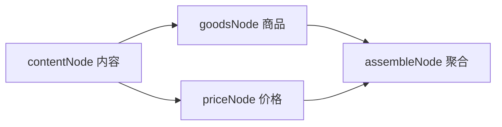
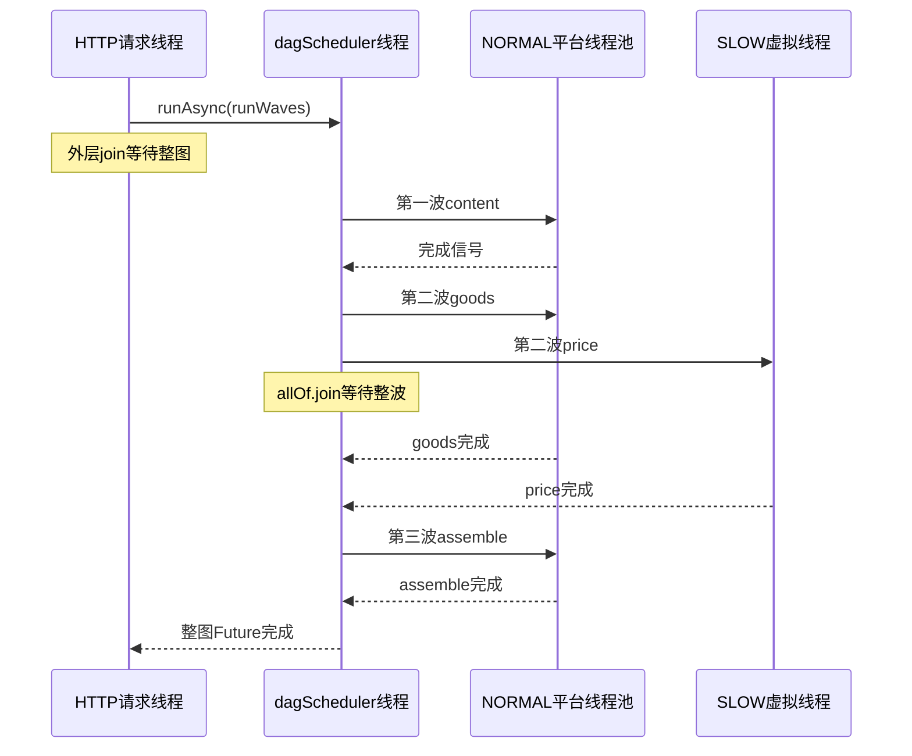

# 第 04 课：从依赖图推演到线程上的执行过程

> 前置：第 03 课。目标：画出三波与两层等待。用时：50 分钟。

## 先画图、预测（10 分钟）

先读 [GoodsCardDag.configure](../reference/cms-flow/cms-flow-biz/src/main/java/com/cms/flow/definition/GoodsCardDag.java#L30) 的四条 `EdgeSpec.link`。箭头表示前者完成后，后者才满足这条依赖。



先写出每个节点入度、第一波能执行的节点，以及为什么不能一开始执行 assemble。第二波哪个先打印开始或结束不确定，不应把列表遍历顺序当完成顺序。

## Kahn 波次的五步（15 分钟）

读 [TopoScheduler.runWaves](../reference/cms-flow/cms-flow-core/src/main/java/com/cms/flow/engine/TopoScheduler.java#L63)：

1. 用 `indegree` 记录每个节点尚有多少前置依赖，用 `successors` 记录它完成后会影响谁。
2. 所有入度为 0 的节点成为 `current`。
3. 把 current 中的每个节点交给其执行器，收集一波 Future。
4. `allOf(...).join()` 等当前整波完成，再对它们的后继减入度。
5. 新入度为 0 的节点组成下一波；若最后完成数不等于总节点数，报告可能存在环。

本图三波是 `{content}`、`{goods, price}`、`{assemble}`。入度初始为 0、1、1、2。`finished` 统计已经走完的节点，不等同于“业务成功个数”。

### 两层线程转移



当前 PriceNodeSpec 标记 SLOW；聚合节点由 NodeInvokeExecutorResolver 强制走 NORMAL。这里体现的是读取到的当前默认配置，不是说所有 DAG 都必须这么划分。

## 最小实验（15 分钟）

```powershell
& '.\实验\run.ps1' -Case dag
```

本演示采用固定三波，不实现通用图算法，便于先观察线程名。content=100 ms、goods=200 ms、price=350 ms、assemble=50 ms 都是教学值。忽略竞争与开销，串行约 700 ms，按图并行约 `100 + max(200,350) + 50 = 500 ms`。

观察每个节点的开始/结束事件。成功证据：content 结束后 goods/price 才开始；assemble 开始前两者都已结束。不要要求实测恰好 500 ms。

## 波次屏障的限制与复述（10 分钟）

当前实现等“整波”，并非每个节点一完成就立即释放它的后继。反例：A、B 同波；C 只依赖 A；A=100 ms、B=1000 ms。即使 A 100 ms 就结束，C 仍要等 B 所在整波结束。这个简单模型便于理解，也可能引入额外等待。

课后扩展才考虑事件驱动调度，当前无需改参考源码。

<details><summary>本课自查</summary>

- 外层 join 占住 HTTP 请求线程；内层 join 占住 dagScheduler 工作线程。
- 节点工作在线程池或虚拟线程执行器上推进。
- 同波可能并行，但资源不足时也会排队；依赖不能靠“多开线程”绕过。
- HTTP 节点业务失败是否使 Future 异常，要继续看第 06 课的 catch 与结果存储。

</details>

30 秒复述：从 `edges` 开始，逐项指认第一波、第二波、两个 join 和结果存放位置。
