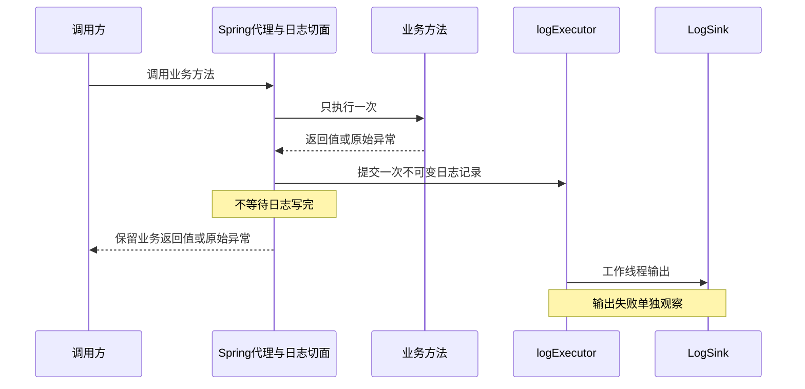

# 桥接讲义：接口、注解、框架调用与线程池

> 对应整合大纲S1、S2、S5、S8。按指定部分阅读，不在8小时之外额外安排整章。`operation-log-lab`的类名来自原任务书设计，尚不是当前目录已经实现的类；cms-flow链接指向已存在的源码。

## 1. 接口：我把哪一种能力交给谁（S1）

先预测：调用者接收一个`LogSink`，换一个实现后，是换了调用者，还是换了具体输出行为？

```java
// 设计片段：只说明对象关系，不是本轮已运行的项目代码。
interface LogSink {
    void write(OperationLogRecord record);
}

class OperationLogService {
    private final LogSink sink;
    OperationLogService(LogSink sink) { this.sink = sink; }
    void record(OperationLogRecord record) { sink.write(record); }
}
```

`LogSink`规定能力，具体实现决定把记录写到控制台还是测试内存。`OperationLogService`只持有接口引用并调用它。纯Java可以手动`new`实现并传入构造器；Spring场景由容器创建、选择并注入注册的Bean。写了接口，不意味着容器自动找到所有实现，也不意味着调用变成异步。

对照cms-flow：看[NodeRequestParser接口](../reference/cms-flow/cms-flow-core/src/main/java/com/cms/flow/spi/NodeRequestParser.java)，再看[HttpNodeExecutor.invokeHttp](../reference/cms-flow/cms-flow-core/src/main/java/com/cms/flow/nodetype/HttpNodeExecutor.java#L108)。节点配置提供解析器类型；执行器向ApplicationContext取对应Bean，再调用其`build`。接口描述怎样组装请求，框架决定在哪个调用点使用实现。

本节只填五问：我提供了什么实现？谁调用？什么时候？怎样选到并注入？实现返回null或失败时怎么办？然后进入知识章01，区分“对象被调用”和“任务被哪个线程执行”。

## 2. 注解：声明信息与处理信息分开（S2前半段）

原任务书里的`@OpLog("修改资料")`声明操作名称。必须有代码读取它、构造记录并调用LogSink，日志才会产生。运行时保留只说明运行时能读到，不代表自动执行处理逻辑。

这里最容易与Spring的扫描能力混淆。cms-flow的[FlowDag](../reference/cms-flow/cms-flow-core/src/main/java/com/cms/flow/dag/FlowDag.java)同时声明TYPE、RUNTIME，并带`@Component`；这使它可以参与Spring组件扫描。真正收集、读取和注册图的代码在[FlowDagDefinitionCollector](../reference/cms-flow/cms-flow-core/src/main/java/com/cms/flow/dag/FlowDagDefinitionCollector.java#L26)。

只看它的启动回调，沿这条链找证据：

```text
Spring完成单例初始化后调用afterSingletonsInstantiated
  → getBeansWithAnnotation(FlowDag.class)
  → 检查Bean实现FlowDagDefinition
  → 读取FlowDag元数据
  → 调用definition.configure(builder)
  → 校验并注册DagDefinition
```

这是启动期装配。请求到来后才由运行时调度器执行图；不是每次请求都重新读取注解并构建整个拓扑。`@FlowDag`也不是AOP切面的别名。

动手取证：自己在Collector里找出“读取信息”“调用用户实现”“注册结果”三处。原任务书M2的反射实验会在后续工程实践中单独实现，本节不把源码阅读算成该测试通过。

## 3. AOP：处理器怎样进入业务调用（S2后半段）

同步操作日志的设计链路是：

```text
外部Bean → Spring代理 → OperationLogAspect
                         → 业务方法（只执行一次）
                         → 构造OperationLogRecord
                         → OperationLogService → LogSink
```

在同步阶段，切面、业务和Sink仍在当前调用线程上执行。环绕通知通过一次`proceed`调用业务，再测量耗时并记录成功或异常；日志的普通输出故障需要独立处理，不能替换原业务返回值或原始异常。严重Error不作为普通输出失败吞掉。这些是拟建项目的行为要求，验收在M3。

默认代理模式需要调用经过代理。目标对象在自身方法里直接调用另一个方法，可能绕过代理增强；`@Async`也有相似的代理边界，但它触发的是异步提交能力。**AOP不是线程池，注解也不是工作线程。**

这里只支持原任务书约定的“实现类公开方法直接标注OpLog且从外部经过Spring代理”场景；不在第一轮展开继承、桥接方法等兼容规则。Spring相关语义可对照[官方任务执行文档](https://docs.spring.io/spring-framework/reference/integration/scheduling.html)，本课没有新建或运行代理测试。

预测题：只加`@OpLog`、不注册任何读取它的处理器，会出现记录吗？同步切面里调用Sink，会自动换线程吗？先回答，再沿设计调用链检查。

## 4. 从同步日志到一次异步提交（S5）

设计中的M5链路：



工作线程可能在调用方返回之前或之后开始运行，图不保证固定时间顺序；关键要求是业务返回不依赖Sink完成。用不可变记录传递必要字段，不把整个可变请求对象、业务参数或敏感内容带到异步线程。

主链路显式提交给命名的`ThreadPoolTaskExecutor logExecutor`。`@Async("logExecutor")`保留为独立对照Bean，通过外部Bean调用并观察Future异常，不能再处理主链路同一条日志。否则可能出现重复日志或不必要的双重异步。

### 与cms-flow并排看

| 场景 | 结果是否决定当前响应 | 等待点 | 失败边界 |
|---|---|---|---|
| DAG节点执行 | 当前响应依赖所需节点结果 | TopoScheduler的两层join | 调度异常或节点失败结果进入相应处理 |
| cms-flow缓存旁路任务 | 通常不等待缓存写完成 | SideEffectRunner不join | 当前池可丢弃并计数，部分执行失败记录warn |
| 拟建操作日志 | 本课程定义为尽力记录，业务响应不依赖Sink完成 | 请求链不get/join | 提交拒绝和已接收任务输出失败分别可观察，普通日志故障不覆盖业务结果 |

只精读[SideEffectRunner.execute](../reference/cms-flow/cms-flow-core/src/main/java/com/cms/flow/executor/SideEffectRunner.java#L31)和[Registry的sideEffect构造](../reference/cms-flow/cms-flow-core/src/main/java/com/cms/flow/executor/FlowExecutorRegistry.java#L75)。它们提供“旁路执行”的真实对照，但拒绝策略和异常处理不应原样照搬：现有SideEffectRunner捕获Throwable；操作日志任务书则要求普通失败不覆盖业务结果且不吞严重Error。

当前sideEffect池的自定义拒绝处理器会丢弃并计数；拟建logExecutor要明确抛出拒绝，在提交边界计数、处理。这不是两个项目必须使用同一策略。

### 三个不同的量

- 业务调用成功：业务返回了正常结果。
- 日志任务被接受：执行器接受了此次提交，不代表已输出。
- 日志输出成功：工作线程实际完成Sink调用。

另外记录“提交拒绝次数”和“输出失败次数”。不要只用一个总失败数混在一起，也不要把Future无人读取时的异常当成已观察。

## 5. 线程池、配置与关闭怎样迁移（S3、S8）

原有演示使用core=2/max=3/queue=2：任务持续阻塞时接纳5个、第6个拒绝。任务书M4使用2/4/3：在工作线程创建成功、池未关闭、任务都未结束的同样条件下接纳7个、第8个拒绝。

这是参数迁移，不是数学结论矛盾。当前saturation演示实际验证的是2/3/2；2/4/3、关闭后拒绝和submit异常读取的完整检查仍列入M4，不能写成已经运行过。

`ThreadFactory`由线程池需要创建线程时调用；`RejectedExecutionHandler`由线程池接不住新提交时调用。你提供实现，执行器在特定时机回调，这和“我提供LogSink，由日志服务调用”是同一种接口接入关系。

配置也要追消费链：[CmsFlowExecutorProperties](../reference/cms-flow/cms-flow-core/src/main/java/com/cms/flow/autoconfigure/CmsFlowExecutorProperties.java) → [AutoConfiguration工厂方法](../reference/cms-flow/cms-flow-core/src/main/java/com/cms/flow/autoconfigure/CmsFlowAutoConfiguration.java#L78) → Registry构建实际池。拟建日志项目的M6要单独验证非法配置初始化失败、禁用时不提交和有界关闭，不把“配了字段”当行为生效。

现有演示用同步器确定观察点，部分使用sleep模拟耗时，**不靠sleep推断任务已经完成**。它们有门闩超时和关闭所有者，但目前`ExecutorService.close()`本身没有独立终止时间上限；因此不能把既有演示写成已经满足原任务书“所有测试均有界关闭”的工程验收。后续M4—M6需按任务书验证释放阻塞任务、shutdown、awaitTermination及必要的shutdownNow，并检查任务响应中断。

## 6. 五问迁移表与S8练习

先自己填写至少三行，不要求现在编写新Spring工程：

| 组件 | 我提供什么 | 谁使用 | 何时使用 | 怎样接入 | 失败怎么办 |
|---|---|---|---|---|---|
| LogSink | 接口实现 | 日志服务/异步任务 | 一次记录输出时 | 构造器注入选定Bean | 普通输出失败独立计数，不覆盖业务结果 |
| OpLog | 方法上的操作名称 | 拟建日志切面 | 经代理调用时 | 注解和切面均接入Spring | 未配置处理器时不会自动产生日志 |
| ThreadFactory | 待填写 | | | | |
| RejectedExecutionHandler | 待填写 | | | | |
| FlowDagDefinition | 待填写 | | | | |
| NodeRequestParser | 待填写 | | | | |
| logExecutor配置 | 待填写 | | | | |

S8的三个测试设计题：

1. 怎样用门闩阻塞Sink，并证明业务返回不依赖它？写出启动信号、返回信号、最长等待和finally释放位置。
2. 怎样人为制造队列满，证明只增加拒绝计数且业务原返回值/异常保持不变？
3. 怎样让已接收任务的Sink抛普通异常，证明输出失败可见且没有生成第二条日志？

这些题目前只要求设计并解释；工程实现和测试运行证据分别记录在M5/M6。完成之后再选课后DAG TODO或M0项目实践，不同时展开两个实现任务。
